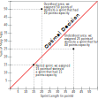
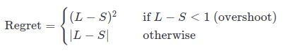
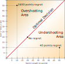

# Agile Optimization

**TL;DR:** Come up with an algorithm that maximizes the chances to choose the right amount of stories for a given sprint.

## Context
Nowadays, it's usual for IT teams to work in an agile way, that involves mainly to chop whole features into small bits, called user stories, and assigning them to time spans, called sprints, that usually last one week.

Coming up with the right amount of stories for each sprint is desirable as:
- Fewer stories than the team capacity would mean not reaching its full potential
- More stories than the team capacity would raise the frustration and demotivate the team members.

To help with above, it's usual to assign points to the stories to represent their complexity. Then, sprint after sprint one can assign a certain amount of these points depending on how many days are in the sprint and/or how many team members will be available.

## Sizes and Lengths
Throughout this document whenever we talk about size, we are meaning stories, whereas sprints have length. Still both concepts point to the same reality, points that are, in turn, proxies for time given that we are mapping these points to time scales.

## Sources of uncertainty
Above context poses two independent sources of uncertainty, namely, we don't know how big stories are before doing them and, we don't know how much effective time a sprint has.

1. **Variations on story sizes:**
Whenever we estimate a story it's not clear how many points it has for real. These are the factors that affect the real size of a given story:
    - They are more or less complex than expected
    - How many teammates review it: when a story is done by a team member, there's a peer review process, more peers increase the likelihood of changes that slow down the whole process.
    - Who picks the story: different team members have different areas of expertise and, it might be that the teammate who picks the story is not the most familiar with its context making it longer.
    - Issues with the environment: sometimes it happens that the development environment poses problems that delay the start or the progress of the story.
    - Personal motivation: it might happen that the member who picks the story is struggling with personal aspects of their life that avoids them to fully concentrate.
    - When it comes to estimation based on points, there isn't a common and normalized understanding of what a point means and this concept changes from person to person and, even for the same person, from time to time. Put it another way, if stories were estimated in hours rather than points, there would be a common concept of *hour* that is shared by all the team members and does not change (as long as you move well below the speed of light). Therefore, people would only disagree in the number of hours. In addition to this, the fact that this kind of estimations happen in team planning sessions make the voters not being independent which can lead to misleading estimations because of the social component.
    - Luck: finally, we can't dismiss the role of luck when tackling a story in the sense that, for longer stories that allow several approaches, the owner chooses the right one first. Of course, this is related to owner's level of expertise as more experienced developers instinctively know what is the best approach or have a narrower range of tries. 

2. **Variations on sprint's effective time:**
Whenever a sprint starts, its length is known, say one week, but the effective time to work on stories is unknown. Therefore, the amount of points that each sprint allows is variable. These are the factors that affect sprint length:
    - Stuff that crop up throughout the sprint, like log errors, meetings or support tickets.
    - Personal motivation affecting the time dedicated to work on stories.

## Definitions
A few terms that we will find throughout this document:

**Optimal decision:** Matching the real points of the stories (size) to the number of real points in the sprint (length)

**Regret:** a value that represents our regret had we chosen the stories whose real size matched the real length of the sprint. Note that overshooting carries more regret as it demotivates way more than falling short. We calculate our regret using the following rule:

Where L is the real length of the sprint and S is the sum of real sizes of the stories in that sprint.

## Goals
With above in mind we can now define the goals for the algorithm:

1. Maximize the chances to land in the optimal decision
2. Minimize the regret when we don't land in the optimal decision

Specifically, the goal for the algorithm is to pick stories whose real size sum will be the closest possible to the real length of the sprint avoiding overshooting as much as possible.

An ideal algorithm should also show a log-like regret curve, meaning that it's learning something in the process, and it's improving sprint after sprint.

## Experiment
Before writing any optimization algorithm we might want to define how we are going to compare them one another. So, we will create an experiment that has two parts: an environment and an evaluator.

### ExperimentEnvironment
Basically this part poses an environment that the algorithms can use to come up with their best set of stories. It will create two objects: 
- **A dataframe of sprints:** containing the people, the days, the points (assuming that one day equals to 1 point) and the real length of the sprint.

| id  | people | days | points | real_length |
|-----|--------|------|--------|-------------|
| 10  | 5      | 10   | 50     | 61          |

- **A dataframe with stories':** estimations and real sizes and a matching index on the sprint dataframe. We will pick stories for each sprint whose sum will be well above the `real_length` of the sprint. To do so, we will create a *bag of stories* that will contain both `estimated_size` and `real_size`. The estimated sizes won't be uniform as not all the sizes will be equally likely, so we need to do a weighted sampling from the distribution of points.

| id  | sprint_id | estimated_size | real_size |
|-----|-----------|----------------|-----------|
| 15  | 10        | 5              | 5         |
| 16  | 10        | 3              | 5         |
| 17  | 10        | 5              | 2         |

### ExperimentEvaluator

**Algorithm output:**
The algorithm basically outputs the set consecutive indices, i.e. stories, for each `sprint_id` plus a number that rounds up to their estimation of the real length of the sprint. Put it another way, they should tell when we should stop adding stories to the sprint and how many 1-point-like stories we should add to get closer to the real value. This way, all the algorithms will have the same common framework and, they will only differ in the story_id they stop and the 1-pointers they assign.

**Evaluation:**
Once the algorithm has come up with the set of stories and the 1-pointers, it sends them to the evaluator that will compute the regret between the real length of the sprint and the real size of the stories chosen by the algorithm.

## Algorithms
In the `algorithms` module the algorithms are defined in deep but, in a nutshell, these are the algorithms we will test:

### E00Perfect algorithm
This algorithm just uses the real length and the real sizes to prove that achieving perfect score is possible. It fails two sprints likely because of the sprints whose first story contains more points than the length of the sprint itself.

### E01SimpleAlgorithm
Just assumes that a person does one point per day and assigns that value in stories.

### E02SimpleAlgorithmRecallingMean
It calculates the points per person and per day dynamically out of the mean of the previous sprints.

### E03ShiftedStories
Shifted stories approach shifts up the estimated sizes of the stories proportionally to their size before doing any calculation, and then estimates the length of the sprint in a similar way to that of `E02SimpleAlgorithmRecallingMean`

### E04LossFn
This algorithm exploits the fact that the evaluator will use a regret matrix to estimate our penalisation and replicates such matrix in the decision. To minimise the regret it accepts a `regret_factor` that allows us to make the regret function more or less dramatic.

**Loss function approach with memory learning regret:** 
Given that we allow a regret factor it would be great to learn its value for each sprint. To do so we come up with a bayesian estimation between what we chose in the past and what we should have chosen (the factor that would have returned exactly the length). However, this didn't work very well, 69k regret and 102 nailed sprints, mainly because of two reasons:
- We weren't including in our computations the uncertainty of the stories.
- The `estimate_length` method was unable to reach the real points in the sprint 

### E05LossFnShifted
Shifted stories worked rather well and also the loss function so in this algorithm we will mix both to reduce a bit more the regret.

### E06LinearRegression
This algorithm is based in the assumption that we can compute a linear model on previous sprints to come up with a slope and an intercept to shift both sprints' estimated length and stories' estimated sizes in a way that we will reduce the error.

## Summary table of algorithm performance
There are two notebooks comparing algorithms one another: one is based on stories from 1 to 20 points, `algorithm_oucomes.ipynb`, and the other excludes the 20 point ones, `algorithm_outcomes_no_20.ipynb`

Here there are the summary tables for each algorithm

### With 20 point stories
| Algorithm                       | total_regret | mean   | std  | nailed sprints | sprints_overshot |
|---------------------------------|--------------|--------|------|----------------|------------------|
| E00PerfectAlgorithm             | 0            | 0      | 0.03 | 4998           | 2                |
| E01SimpleAlgorithm              | 90k          | -12.14 | 7.89 | 76             | 4703             |
| E02SimpleAlgorithmRecallingMean | 77k          | -10.8  | 7.83 | 110            | 4578             |
| E03ShiftedStories               | 13.2k        | -0.03  | 6.57 | 329            | 2279             |
| E04LossFn(7.5)                  | 13.4k        | 1.05   | 6.81 | 262            | 1902             |
| E04LossFn(8)                    | 12.1k        | 2.1    | 6.68 | 267            | 1609             |
| E05LossFnShifted(.8)            | 13k          | .17    | 6.59 | 344            | 2242             |
| E05LossFnShifted(1.6)           | 10.8k        | 2.07   | 6.46 | 300            | 1668             |
| E05LossFnShifted(2.5)           | 10.2k        | 3.7    | 6.36 | 264            | 1247             |
| E06LinearRegression             | 8.3k         | 3.15   | 5.54 | 300            | 1250             |

### Without 20 point stories
| Algorithm                       | total_regret | mean   | std  | nailed sprints | sprints_overshot |
|---------------------------------|--------------|--------|------|----------------|------------------|
| E00PerfectAlgorithm             | 0            | 0      | 0.00 | 5000           | 0                |
| E01SimpleAlgorithm              | 141k         | -17.2  | 8.78 | 23             | 4936             |
| E02SimpleAlgorithmRecallingMean | 121k         | -15.76 | 8.53 | 33             | 4906             |
| E03ShiftedStories               | 24.5k        | -3.92  | 7.32 | 244            | 3339             |
| E04LossFn(8)                    | 20k          | -1.96  | 7.54 | 278            | 2694             |
| E04LossFn(8.5)                  | 15.9K        | 2.02   | 8.16 | 230            | 1722             |
| E05LossFnShifted(2.5)           | 13k          | .22    | 6.85 | 272            | 2145             |
| E05LossFnShifted(4.5)           | 10.5k        | 3.11   | 6.71 | 253            | 1357             |
| E06LinearRegression             | 9.6k         | 6.19   | 5.66 | 185            | 572              |

## Conclusions

- **Past points don't help to predict future:**  
The main conclusion we extract from this experiment is that just knowing how well we performed in the past does not carry too much information about how to better estimate future stories or future sprints. This insight is provided by the `accumulated_regret` method of each algorithm that is almost linear and the intuition behind this fact is pretty solid: the points of a given story do not depend on previous stories but rather in the content of the story itself plus some external factors. And, for sprints, is even worse as the length of the sprint depends exclusively on external factors.  

- **Algorithms adjust the location of the mean:**  
This set of algorithms shows that in order to minimise the regret one has to fine tune the location of the mean, that is, in the long run how many points we are assigning on each sprint and, it proves that just naively assigning the mean of previous sprints is not enough to reduce the regret.

- **Falling short accounts for better regret.**  
Since falling short means less regret than overshoot, having positive means reduce the total regret at the expense of a reduction in the nailed sprints

- **The key is the standard deviation:**  
Of course, not only we want to be right in the long run, mean=0, but when we fail, we want to fail really close to that mean and that is measured by the standard deviation. And that's why falling short accounts for better regret as deviating from the mean means asymmetrical regret. But if somehow one could reduce the std, then we would be able to further fine tune the mean and get both, regret and nailed sprints, optimized.
