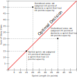

# Agile Optimization

**TL;DR:** Come up with an algorithm that maximizes the chances to choose the right amount of stories for a given sprint.

## Context
Nowadays, it's usual for IT teams to work in an agile way, that involves mainly to chop whole features into small bits, called user stories, and assigning them to time spans, called sprints, that usually last one week.

Coming up with the right amount of stories for each sprint is desirable as:
- Fewer stories than the team capacity would mean not reaching its full potential
- More stories than the team capacity would raise the frustration and demotivate the team members.

To help with above, it's usual to assign points to the stories to represent their complexity. Then, sprint after sprint one can assign a certain amount of these points depending on how many days are in the sprint and/or how many team members will be available.

## Sizes and Lengths
Throughout this document whenever we talk about size, we are meaning stories, whereas sprints have length. Still both concepts point to the same reality, points that are, in turn, proxies for time given that we are mapping these points to time scales.

## Sources of uncertainty
Above context poses two independent sources of uncertainty, namely, we don't know how big stories are before doing them and, we don't know how much effective time a sprint has.

1. **Variations on story sizes:**
Whenever we estimate a story it's not clear how many points it has for real. These are the factors that affect the real size of a given story:
    - They are more complex than expected
    - How many teammates review it: when a story is done by a team member, there's a peer review process, more peers increase the likelihood of changes that slow down the whole process.
    - Who picks the story: different team members have different areas of expertise and, it might be that the teammate who picks the story is not the most familiar with its context making it longer.
    - Issues with the environment: sometimes it happens that the development environment poses problems that delay the start or the progress of the story.
    - Personal motivation: it might happen that the member who picks the story is struggling with personal aspects of their life that avoids them to fully concentrate.
    - Luck: finally, we can't dismiss the role of luck when tackling a story in the sense that, for longer stories that allow several approaches, the owner chooses the right one first. Of course this is related to owner's level of expertise as more experienced developers instinctively know what is the best approach or have a narrower range of tries. 

2. **Variations on sprint's effective time:**
Whenever a sprint starts, its length is known, say one week, but the effective time to work on stories is unknown. Therefore, the amount of points that each sprint allows is variable. These are the factors that affect sprint length:
    - Stuff that crop up throughout the sprint, like log errors, meetings or support tickets.
    - Personal motivation affecting the time dedicated to work on stories.

## Definitions
A few terms that we will find throughout this document:

**Optimal decision:** Matching the real points of the stories (size) to the number of real points in the sprint (length)

**Regret:** a value that represents our regret had we chosen the stories whose real size matched the real length of the sprint. Note that overshooting carries more regret as it demotivates way more than falling short. We calculate our regret using the following rule:

Where L is the real length of the sprint and S is the sum of real sizes of the stories in that sprint.

## Goals
With above in mind we can now define the goals for the algorithm:

1. Maximize the chances to land in the optimal decision
2. Minimize the regret when we don't land in the optimal decision

Specifically, the goal for the algorithm is to pick stories whose real size sum will be the closest possible to the real length of the sprint avoiding overshooting as much as possible.

An ideal algorithm should also show a log-like regret curve, meaning that it's learning something in the process, and it's improving sprint after sprint.

## Experiment
Before writing any optimization algorithm we might want to define how we are going to compare them one another. So, we will create an experiment that has two parts: an environment and an evaluator.

### ExperimentEnvironment
Basically this part poses an environment that the algorithms can use to come up with their best set of stories. It will create two objects: 
- **A dataframe of sprints:** containing the people, the days, the points (assuming that one day equals to 1 point) and the real length of the sprint.

| id | people | days | points | real_length | 
| -- | ------ | ---- | ------ | ----------- | 
| 10 |   5    |  10  |   50   |      61     | 

- **A dataframe with stories':** estimations and real sizes and a matching index on the sprint dataframe. We will pick stories for each sprint whose sum will be well above the `real_length` of the sprint. To do so, we will create a *bag of stories* that will contain both `estimated_size` and `real_size`. The estimated sizes won't be uniform as not all the sizes will be equally likely, so we need to do a weighted sampling from the distribution of points.

| id | sprint_id | estimated_size | real_size
| -- | --------- | -------------- | ---------
| 15 |    10     |        5       | 5
| 16 |    10     |        3       | 5
| 17 |    10     |        5       | 2

### ExperimentEvaluator

**Algorithm output:**
The algorithm basically outputs the set consecutive indices, i.e. stories, for each `sprint_id` plus a number that rounds up to their estimation of the real length of the sprint. Put it another way, they should tell when we should stop adding stories to the sprint and how many 1-point-like stories we should add to get closer to the real value.

**Evaluation:**
Once the algorithm has come up with the set of stories, it sends them to the evaluator that will compute the regret between the real length of the sprint and the real size of the stories chosen by the algorithm.

